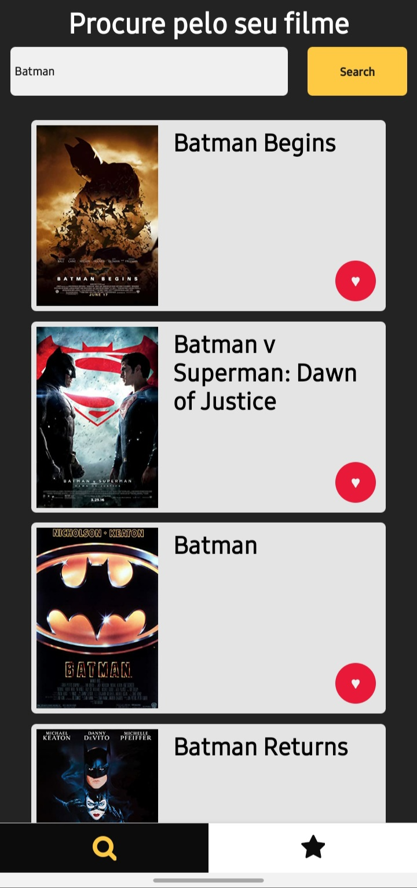
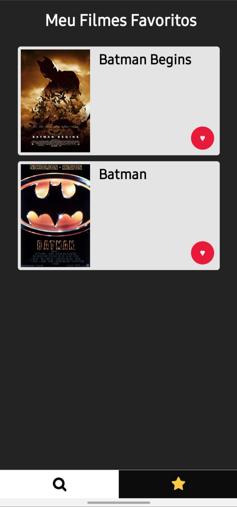

<h1 align="center"> Dev CineApp - MoviesList </h1>
<h4 align="center">
  Projeto para salvar seus filmes favoritos.
</h4>

<div align="center">

&nbsp;

&nbsp;
</div>

<p align="center">
  <a href="#:memo:-Donwload-do-Projeto">Donwload do Projeto</a>
  <!-- &nbsp;&nbsp;&nbsp;|&nbsp;&nbsp;&nbsp;
  <a href="#:iphone:-Donwload-no-Celular">Download no Celular</a> -->
</p>


<div>



</div>


## :memo: Donwload do Projeto
  Para o download do projeto você precisa estar com as configurações requisitadas do <a href="https://reactnative.dev/docs/environment-setup">React-Native</a> já instaladas.

  Feito isso, Faça:

1. O clone o projeto.


```bash
git clone
```
2. Entre na pasta do projeto.

```bash
  cd dev-cinemapp && cd MoviesList
```
3. Instale as dependências.

* **npm**
```bash
npm install
```
* **yarn**
```bash
yarn
```
4. Para iniciar a aplicação:
* **npm**
```bash
npx react-native run-android
```
* **yarn**
```bash
yarn android
```

**Obs: O projeto foi apenas configurado para android.

<!-- ## :iphone: Donwload no Celular

QRCODE -->

---
Projeto criado por <a href="https://www.linkedin.com/in/adriel-borgesti" >Adriel Borges</a>.
